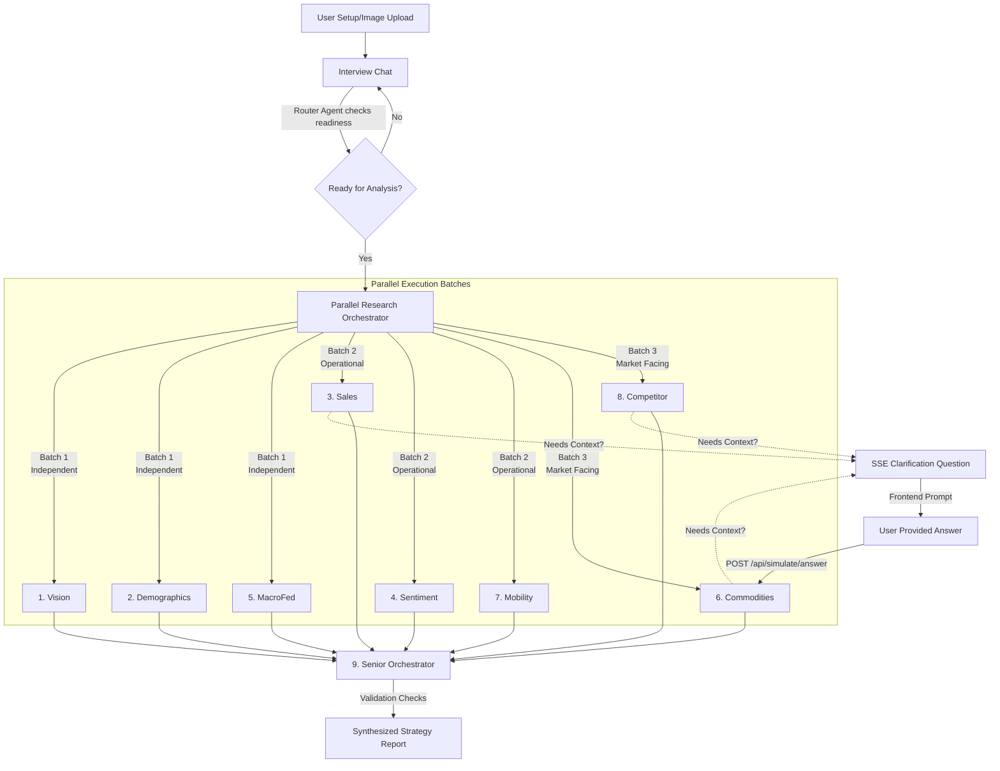

# Praxis Economics: AI-Powered Business Strategy 🚀

[](https://www.kueconomicsinstitute.org/agentic-ai-challenge)
[](https://github.com/Aryagarg23/LCOB_AI_CHALLENGE)
[](https://nextjs.org/)

**Praxis Economics** is an advanced Multi-Agent system designed for the [KU Economics Institute Agentic AI Challenge](https://www.kueconomicsinstitute.org/agentic-ai-challenge). It acts as a world-class strategic consulting firm, generating incredibly deep, localized, and economically sound business viability reports for any aspiring entrepreneur.

The system relies on a swarm of highly specialized AI agents that execute in parallel, fetch real-time public web data, validate against economic principles, and even **pause mid-research to ask the user clarifying questions** before synthesizing the final strategic report.

---

## 🌟 Key Features

1. **Interactive Needfinding Interview:** Rather than a static form, the application begins with a dynamic interview. A router agent extracts exactly what it needs from the conversation, adapting its questions to the user's business experience and goals.
2. **Parallel Multi-Agent Architecture:** Research is distributed across 8 specialized domain agents (Demographics, Macroeconomics, Commodities, Competitors, etc.) that execute in optimized parallel batches, reducing a 5-minute research task to under 60 seconds.
3. **The Mid-Research Clarification Loop:** Agents are not black boxes. If an agent discovers ambiguous data or needs more specific context (e.g., discovering the market is saturated and asking how the user plans to differentiate), it halts its execution and asks the user a question via Server-Sent Events (SSE) while the other agents continue. Once answered, the agent resumes with the new context.
4. **Economic Validation & Anti-Hallucination Guardrails:** The final Orchestrator acts as a senior partner. It validates all agent findings for spatial mismatches, fabrications, and pricing math errors before generating a brutally honest viability report.

---

## 🧠 The Agentic Flow & Architecture

Our architecture is built on the **Vercel AI SDK**, Next.js App Router, and OpenAI's `gpt-4o-mini` (referred to locally as `gpt-4.1-nano` for speed).



### 1. Data Ingestion & Needfinding
Users can upload images (e.g., a photo of a storefront or product) alongside their ZIP code. Instead of rigidly answering a survey, users chat with an AI interviewer. The interviewer evaluates the conversation continuously. Once it has enough context (or realizes the user is unsure and needs guidance), it transitions the app state automatically.

### 2. Parallel Agent Execution
The Vercel AI SDK allows us to execute stateful, tool-calling agents. To avoid rate limits and dependency deadlocks, we run the 8 research agents in three logical batches. They leverage a `web_search` tool to pull real pricing, competitor names, and demographic stats.

### 3. The Mid-Research Clarification Loop (State Machine Pause & Resume)
Unlike traditional "fire-and-forget" generation, our agents are state-aware. 
- If an agent (e.g., the Competitor Agent) generates a `clarificationQuestion` via its structured JSON output schema, the backend emits an SSE (Server-Sent Event) to the frontend.
- The UI surfaces this question in a live chat interface next to the research progress cards.
- The backend pauses that specific agent's execution promise using a global `pendingAnswers` map.
- When the user answers, the frontend POSTs to `/api/simulate/answer`, which resolves the promise. 
- The agent re-runs, prioritizing the `userAnswer` in its context to finalize the node.

### 4. Synthesis and Validation
Once all 8 agents complete safely, the data is dumped into the **Orchestrator Agent**. Before writing blindly, the orchestrator runs a Chain-of-Thought (CoT) validation step ensuring:
- Competitors actually exist and aren't AI fabrications.
- Commodity marginal costs align chronologically and mathematically.
- Missing demographic data is acknowledged rather than spoofed.

---

## 🕵️ Meet the Swarm (The 9 Agents)

1. **Brand Vision Agent:** Uses vision models to evaluate uploaded imagery against the stated brand goals, outputting a "Hedonic Premium Score".
2. **Demographics Agent:** Pulls local income and consumer data for the target ZIP.
3. **Sales Historian:** (Mock) writes and executes Node.js code to parse uploaded CSV databases to calculate Price Elasticity of Demand.
4. **Sentiment Analyst:** Scrapes reviews and social perception of the brand or equivalent local competitors.
5. **Macro Fed Agent:** Establishes the macroeconomic climate (rates, inflation sentiment).
6. **Commodities Analyst:** Tracks raw supply chain costs (e.g., raw cotton vs retail fabric) to establish an absolute marginal cost floor.
7. **Urban Mobility Agent:** Evaluates walkability and transport access to the chosen location.
8. **Competitor AI:** The most aggressive researcher—scours the web to find *real* local competitors, forces source URL citing, and checks market saturation.
9. **The Orchestrator:** The senior partner. Synthesizes the JSON outputs of the 8 sub-agents into a beautifully formatted, mathematically sound Markdown report.

---

## 🔒 Security

All Supabase storage integrations are securely handled server-side via Next.js API Routes (`/api/upload-image`, `/api/artifacts`). `NEXT_PUBLIC` keys for sensitive databases have been entirely stripped to prevent bundle leakage.

---

## 💻 Running Locally

1. Clone the repository:
   ```bash
   git clone https://github.com/Aryagarg23/LCOB_AI_CHALLENGE.git
   cd LCOB_AI_CHALLENGE
   ```
2. Install dependencies:
   ```bash
   npm install
   ```
3. Set your internal environment variables pointing strictly to your API keys (Supabase and OpenAI) in a `.env.local` file:
   ```env
   SUPABASE_URL="..."
   SUPABASE_SERVICE_ROLE_KEY="..."
   OPENAI_API_KEY="..."
   ```
4. Start the application:
   ```bash
   npm run dev
   ```
5. Navigate to `http://localhost:3000` to begin your consultation.
