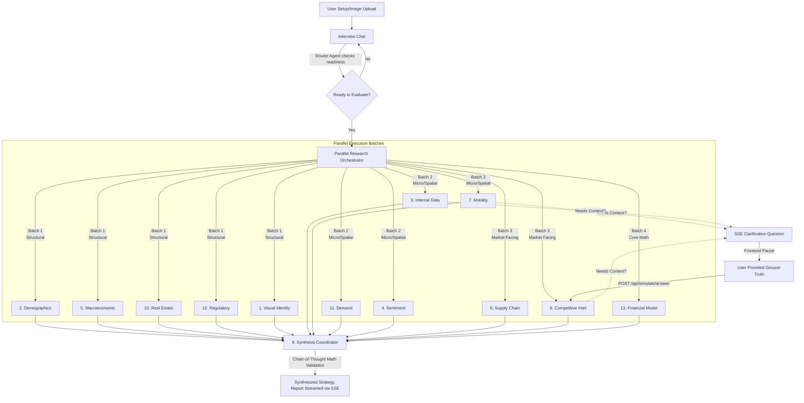

# Praxis Economics: AI-Powered Firm Strategy & Market Validation 🚀

[](https://www.kueconomicsinstitute.org/agentic-ai-challenge)
[](https://github.com/Aryagarg23/LCOB_AI_CHALLENGE)
[](https://nextjs.org/)

**Praxis Economics** is a Multi-Agent system designed for the [KU Economics Institute Agentic AI Challenge](https://www.kueconomicsinstitute.org/agentic-ai-challenge). 

Praxis serves as a strategic analysis tool, generating localized business viability reports for entrepreneurs. It utilizes a 13-agent AI architecture to address the **information asymmetries** and **search frictions** that often affect Small and Medium Business (SMB) formation.

---

## 📉 The Economic Problem

In economics, efficient markets require accessible information. However, the formation of Small and Medium Businesses (SMBs) is often characterized by **Information Asymmetry** and **Search Frictions**:

1.  **Credit Rationing & Asymmetry:** Entrepreneurs may lack access to comprehensive market research. This asymmetry can contribute to "credit rationing"—where financial institutions may hesitate to lend to unverified SMBs.
2.  **Search Frictions:** Gathering data on local market saturation, competitor pricing, foot-traffic, and rent constraints requires time and resources. These frictions can lead to inefficient capital allocation.

**The Strategy:** Praxis Economics aims to reduce these frictions by providing localized economic analysis through an automated, parallel-agent system.

---

## 🌟 Rubric Alignment & Key Features

This project was built to directly satisfy the Kautz-Uible Agentic AI Challenge Evaluation Categories:

### 1. Economic Relevance of the Agent
Praxis directly addresses the well-defined economic problem of SMB formation friction. It links outputs directly to macroeconomic realities (Federal Reserve sentiment, commodity floors) and microeconomic models (Price Elasticity of Demand, localized spatial competition). Every generated report acts as a tangible artifact that an entrepreneur can use to secure capital or pivot their strategy, satisfying the economic needs of the end-user.

### 2. Sophistication & Complexity
Praxis utilizes dynamic planning and an advanced **Mid-Research Clarification Loop**. Agents are not black boxes; they execute with state-awareness. If an agent discovers ambiguous data, it pauses execution and uses Server-Sent Events (SSE) to ask the user a clarifying question in real-time. This functions as a form of **Iterative Bayesian Updating**—updating its prior assumptions with ground-truth data before finalizing the localized report.

### 3. Originality of the Agent
Instead of a standard massive prompt, Praxis employs a **Parallel Domain-Specific Swarm**. 12 distinct agents execute simultaneously gathering unique economic vectors. The 13th "Orchestrator" agent runs a Chain-of-Thought (CoT) validation sequence over the JSON outputs—ensuring break-even math maps to realistic commercial real estate NNN leases, completely isolating hallucinations before streaming the final Markdown report.

---

## 🕵️ Meet the Swarm: Economic Specialization (The 13 Agents)

The intelligence of Praxis lies in the strict economic specialization of its agents.

1.  **Agent 1 (Visual Identity Analysis):** Evaluates visual assets against behavioral economic principles, critiquing aesthetic viability and consumer trust generation.
2.  **Agent 2 (Demographic Profiling):** Pulls highly localized household income tranches, labor market density, and regional GINI coefficients for the target ZIP.
3.  **Agent 3 (Internal Data Analysis):** Calculates **Price Elasticity of Demand (PED)** and internal consumer surplus thresholds based on uploaded operational data.
4.  **Agent 4 (Social Sentiment Aggregation):** Gauges consumer preference shifts and macro-social brand perceptions relative to substitution goods.
5.  **Agent 5 (Macroeconomic Tracking):** Contextualizes the SMB against macroeconomic headwinds: current Federal funds rates, core PCE inflation metrics, and aggregate consumer spending outlooks.
6.  **Agent 6 (Supply Chain Cost Analysis):** Tracks upstream raw supply chain costs (e.g., raw cotton vs. retail fabric) to construct an **absolute floor for marginal costs**.
7.  **Agent 7 (Spatial & Mobility Analysis):** A Spatial Econometrics agent. Evaluates local transit layouts, WalkScores, and foot-traffic multiplier zones.
8.  **Agent 8 (Competitive Intelligence):** Reduces search friction explicitly by finding direct and indirect local market substitutes, establishing total market saturation.
9.  **Agent 9 (Synthesis Coordinator):** Synthesizes the 12 JSON agent outputs. It runs a CoT validation to ensure mathematical consistency before streaming the final report.
10. **Agent 10 (Real Estate Cost Estimation):** Calculates localized commercial lease averages (NNN, CAM factors) per sq-ft to establish fixed-cost baselines.
11. **Agent 11 (Market Demand Validation):** Estimates the localized aggregate transaction volume ceiling (Total Addressable Market proxies) via digital search volume.
12. **Agent 12 (Regulatory Compliance Mapping):** Maps compliance transaction costs—zoning barriers, licensing prerequisites, and structural market-entry barriers.
13. **Agent 13 (Financial Modeling):** Evaluates absolute unit economics. Calculates Break-Even points (BEP) and expected gross mathematical returns mapped against the fixed/variable costs aggregated by the other agents.
13. **Agent 13 (Quant Math):** Evaluates absolute unit economics. Calculates Break-Even points (BEP) and expected gross mathematical returns mapped against the fixed/variable costs aggregated by the other agents.

### 🧩 The Synthesis: From Raw Data to SMB Strategy

Individually, these agents gather distinct economic variables. Together, they combine to form a **business strategy report** designed to guide the SMB entrepreneur:

*   **Establishing the Financial Moat:** **Agent 6 (Commodities)** defines the absolute minimum cost to produce a good. **Agent 8 (Competitors)** defines the maximum price the local market will bear. **Agent 13 (Quant Math)** bridges this gap, instantly calculating the exact profit margin and how many units must be sold to cover the fixed lease costs identified by **Agent 10 (Real Estate)**. 
*   **Validating the Addressable Market:** **Agent 11 (Demand)** estimates how many total customers exist online, while **Agent 7 (Urban Mobility)** calculates how many of those customers can actually *physically reach* the storefront. **Agent 2 (Demographics)** ensures those arriving customers actually have the disposable income necessary to convert.
*   **De-Risking the Launch:** Before the entrepreneur ever signs a lease, **Agent 12 (Legal)** highlights hidden compliance friction, and **Agent 5 (Macro)** warns them if rising Federal interest rates will make their initial small-business loan too expensive to service.

The **Orchestrator (Agent 9)** acts as the final judge. It doesn't just staple these 12 reports together; it cross-references them. *If the math agent calculates high profitability, but the real estate agent flags zoning prohibitive to the business type, the Orchestrator will rewrite the final strategy to warn the user of the critical flaw.* The result is a robust, localized, and mathematically sound survival guide for the SMB.

---

## 🧠 Technical Architecture & Agentic Flow

Built on the **Vercel AI SDK**, Next.js App Router, and React Server Components (RSC), Praxis balances intense parallel compute with smooth UI state transitions.



### Democratizing Business Intelligence
Generated strategy reports can be saved as artifacts via Supabase, allowing entrepreneurs to review and share their localized market analysis.

---

## 💻 Running Locally

1. Clone the repository:
   ```bash
   git clone https://github.com/Aryagarg23/LCOB_AI_CHALLENGE.git
   cd LCOB_AI_CHALLENGE
   ```
2. Install dependencies:
   ```bash
   npm install
   ```
3. Set your internal environment variables pointing strictly to your API keys (Supabase and OpenAI) in a `.env.local` file:
   ```env
   SUPABASE_URL="..."
   SUPABASE_SERVICE_ROLE_KEY="..."
   OPENAI_API_KEY="..."
   ```
4. Start the application:
   ```bash
   npm run dev
   ```
5. Navigate to `http://localhost:3000` to begin your consultation.

---

*Submission created for the Kautz-Uible Economics Institute Agentic AI Challenge (University of Cincinnati).*
