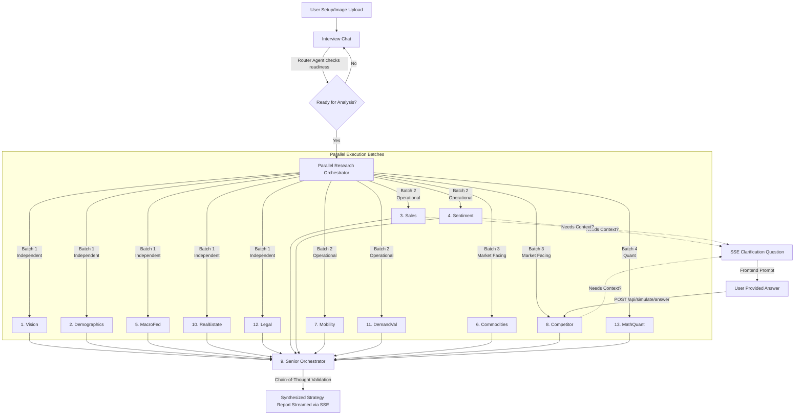

# Praxis Economics: AI-Powered Business Strategy 🚀

[](https://www.kueconomicsinstitute.org/agentic-ai-challenge)
[](https://github.com/Aryagarg23/LCOB_AI_CHALLENGE)
[](https://nextjs.org/)

**Praxis Economics** is an advanced Multi-Agent system designed for the [KU Economics Institute Agentic AI Challenge](https://www.kueconomicsinstitute.org/agentic-ai-challenge). It acts as a world-class strategic consulting firm, generating incredibly deep, localized, and economically sound business viability reports for any aspiring entrepreneur.

The system relies on a swarm of highly specialized AI agents that execute in parallel, fetch real-time public web data, validate against economic principles, and even **pause mid-research to ask the user clarifying questions** before synthesizing the final strategic report.

---

## 🌟 Key Features

1. **Interactive Needfinding Interview:** Rather than a static form, the application begins with a dynamic conversational interview. A router agent extracts exactly what it needs from the conversation, adapting its questions to the user's business experience and goals.
2. **Parallel Multi-Agent Architecture:** Research is distributed across 12 domain-specific agents (Demographics, Macroeconomics, Commodities, Competitors, Real Estate, Demand Validation, Legal, etc.) and 1 synthesis agent. They execute in optimized parallel batches, reducing comprehensive research tasks to under 60 seconds.
3. **Real-time Report Streaming:** The final strategy report streams natively to the user interface via Server-Sent Events (SSE), dramatically reducing perceived wait times while exposing the Orchestrator's thought process.
4. **The Mid-Research Clarification Loop:** Agents are not black boxes. If an agent discovers ambiguous data or needs more specific context, it halts its execution and asks the user a question via SSE while the other agents continue. Once answered, the agent resumes with the new context.
5. **Economic Validation & Anti-Hallucination Guardrails:** The final Orchestrator acts as a senior partner. It validates all agent findings using Chain-of-Thought (CoT) routines to detect spatial mismatches, fabricated competitor data, and pricing math errors before streaming a brutally honest viability report.
6. **Democratizing Business Intelligence (Public Artifacts):** Generated strategy reports are hosted as public artifacts via Supabase. This brings elite, institutional-grade economic insights to the broader community at near-zero cost, radically democratizing access to high-powered market analysis.

---

## 🧠 The Agentic Flow & Architecture

Our modern architecture is built on the **Vercel AI SDK**, Next.js App Router, React Server Components (RSC), and OpenAI models (`gpt-4o-mini` functioning as our fast agents, and `gpt-4o` for the Orchestrator).



### 1. Data Ingestion & Needfinding
Users can upload images (e.g., a photo of a storefront or product) alongside their ZIP code. Instead of rigidly answering a survey, users chat with an AI interviewer. The interviewer evaluates the conversation continuously. Once it has enough context (or realizes the user is unsure and needs guidance), it transitions the app state automatically.

### 2. Parallel Agent Execution
Using the Vercel AI SDK, we orchestrate stateful, tool-calling agents. To avoid rate limits and dependency deadlocks, the 12 primary research agents are bucketed logically into batches. They leverage native web-search integrations to pull real pricing, competitor names, and demographic stats in parallel.

### 3. The Mid-Research Clarification Loop (State Machine Pause & Resume)
Unlike traditional "fire-and-forget" generations, our agents are inherently state-aware. 
- If an agent determines that its context is too ambiguous, its structured output requests a `clarificationQuestion`. The backend immediately emits an SSE to the frontend.
- The UI surfaces this question in a live chat interface next to the spinning research progress cards.
- The backend pauses that specific agent's execution promise asynchronously using a global `pendingAnswers` map.
- When the user answers, the frontend POSTs to `/api/simulate/answer`, which resolves the promise. 
- The agent re-runs, appending the `userAnswer` to its cognitive context to finalize the node.

### 4. Synthesis, Streaming, and CoT Validation
Once the swarm completes securely, the data is handed to the **Orchestrator Agent**. Before generating any output, the orchestrator triggers a strict CoT validation step (leveraging `generateObject`) to computationally verify that:
- Break-even mathematics map accurately to real estate rent estimates.
- Competitors actually exist and aren't simply AI hallucinations.
- Missing demographic data is acknowledged rather than spoofed.
Upon successful validation, the orchestrator utilizes `streamText` to push chunks to the client dynamically, yielding an immersive real-time reading experience. Sources are contextually embedded natively within the copy.

---

## 🕵️ Meet the Swarm (The 13 Agents)

The intelligence of Praxis lies in the extreme specialization of its 13 respective agents.

1. **Brand Vision Agent (`Agent1_Vision`):** Utilizes vision models to evaluate uploaded imagery against the stated brand goals, outputting design critiques and aesthetic viability formatting.
2. **Demographics Agent (`Agent2_Demographics`):** Pulls local household income levels, neighborhood typologies, and hard consumer ceilings for the target ZIP.
3. **Sales Historian (`Agent3_Sales`):** (Mock) Uses generated internal Node.js code to parse uploaded CSV databases to calculate internal Price Elasticity of Demand (PED).
4. **Sentiment Analyst (`Agent4_Sentiment`):** Scrapes external reviews and conducts a macro-social perception analysis of the brand category in specific local corridors.
5. **Macro Fed Agent (`Agent5_Macro`):** Establishes the macroeconomic climate—such as interest rates, inflation metrics, and consumer spending outlooks.
6. **Commodities Analyst (`Agent6_Commodities`):** Tracks upstream raw supply chain costs (e.g., raw cotton vs. retail fabric) to construct an absolute floor for marginal costs.
7. **Urban Mobility Agent (`Agent7_Mobility`):** Evaluates walkability, neighborhood transit layout, foot traffic multiplier zones, and transport routing density to chosen locations.
8. **Competitor AI (`Agent8_Competitor`):** The most aggressive researcher. Scours the web to identify direct and indirect local competitors, forces source URL citing, checks comparative pricing points, and establishes market saturation.
9. **The Orchestrator (`Agent9_Orchestrator`):** The senior partner. Synthesizes the aggregated JSON outputs of the 12 distinct sub-agents. It validates all claims via a CoT pass, streams the final Markdown report, and injects contextual URL sourcing.
10. **Real Estate Agent (`Agent10_RealEstate`):** Calculates typical lease, NNN, and CAM estimates dynamically per sq-ft locally.
11. **Demand Validation Agent (`Agent11_DemandValidation`):** Estimates localized aggregate transaction volume ceilings using search and behavioral data proxies.
12. **Legal & Regulatory Agent (`Agent12_Legal`):** Maps likely licensing, zoning barriers, compliance prerequisites, and startup regulatory costs per specified locale.
13. **Quant Math Agent (`Agent13_Math`):** Evaluates absolute unit economics, break-even calculus, and gross mathematical return metrics based specifically on aggregated expenses sourced natively by other agents.

---

## 🎨 UI & UX Design

Praxis Economics utilizes a pristine, business-focused "light theme." We chose this design paradigm to mirror elite institutional reports. Transparency features natively: animations depict exactly what each agent is thinking, providing instant loading states during heavier compute phases (like CoT validations).

---

## 🔒 Security

All Supabase storage integrations are securely handled server-side via Next.js API Routes (`/api/upload-image`, `/api/artifacts`). `NEXT_PUBLIC` keys for sensitive databases have been entirely stripped to prevent bundle leakage or Client-Side injection vectors.

---

## 💻 Running Locally

1. Clone the repository:
   ```bash
   git clone https://github.com/Aryagarg23/LCOB_AI_CHALLENGE.git
   cd LCOB_AI_CHALLENGE
   ```
2. Install dependencies:
   ```bash
   npm install
   ```
3. Set your internal environment variables pointing strictly to your API keys (Supabase and OpenAI) in a `.env.local` file:
   ```env
   SUPABASE_URL="..."
   SUPABASE_SERVICE_ROLE_KEY="..."
   OPENAI_API_KEY="..."
   ```
4. Start the application:
   ```bash
   npm run dev
   ```
5. Navigate to `http://localhost:3000` to begin your consultation.
